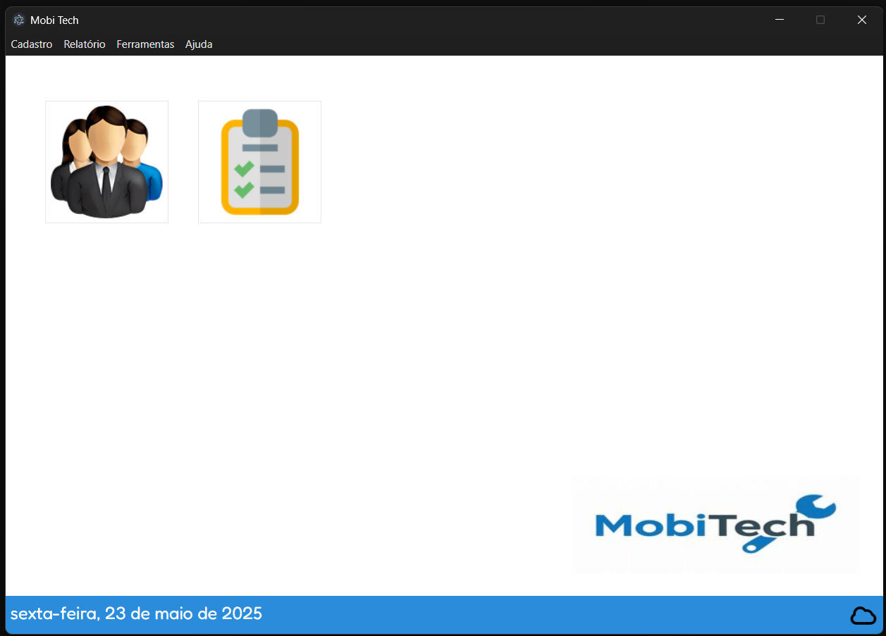
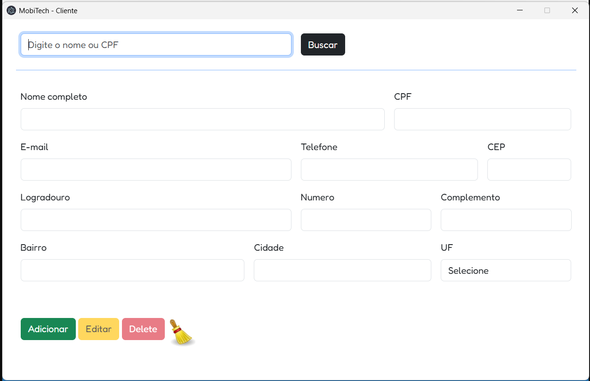
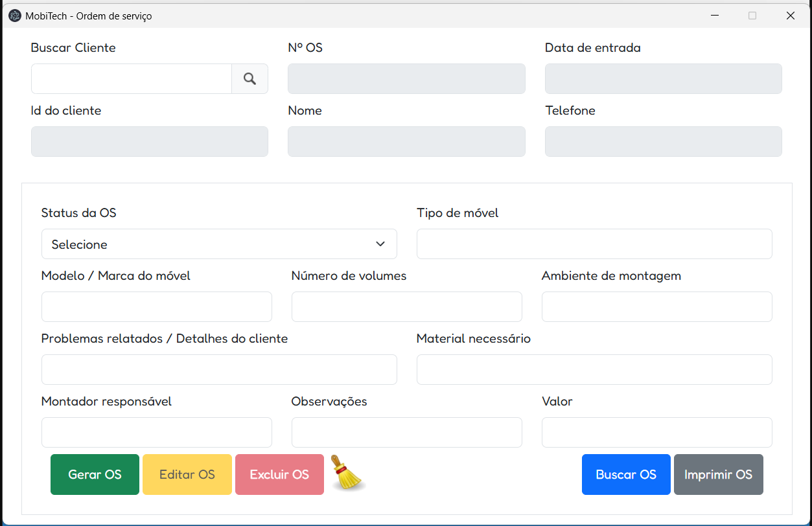

# 🛠️ Mobitech - Sistema de ordens de serviço para montadores de móveis

**Mobitech** é um sistema de gerenciamento de ordens de serviço (OS) voltado para montadores de móveis. Permite o cadastro de clientes, criação e controle de OS, geração de relatórios e impressão de ordens para entrega ao cliente.

## Funcionalidades

- Cadastro de clientes
- Edição de dados dos clientes
- Exclusão de clientes do sistema
- Criação, edição e exclusão de Ordens de Serviço
- Impressão de OS individual para entrega ao cliente
- Geração de relatórios em PDF:
  - Relatório de clientes
  - Relatórios de OS por status:
    - Abertas
    - Em andamento
    - Aguardando material
    - Concluídas
    - Canceladas
  - Relatório geral de OS com status
- Validação de dados de formulário
- Interface intuitiva e impressões estilizadas

## Demonstração

## Autora

[Érica Viana](https://github.com/ericaviana12)

## Tecnologias utilizadas

- [Electron](https://www.electronjs.org/) – Aplicação desktop
- [Node.js](https://nodejs.org/)
- [Mongoose](https://mongoosejs.com/) – ORM para MongoDB
- [MongoDB](https://www.mongodb.com/) – Banco de dados NoSQL
- [jsPDF](https://github.com/parallax/jsPDF) – Geração de relatórios em PDF
- HTML, CSS e JavaScript

## Pré-requisitos de instalação:
- Windows 10 ou superior
- Ter o banco de dados MongoDB instalado

### Instalação do MongoDB:
Acesse o site oficial:
[MongoDB](https://www.mongodb.com/try/download/community)

Baixe o MongoDB Community Server e instale com a opção de "Install MongoDB as a Service" ativada.

Após instalar, ele inicia automaticamente.

### Instalação do MobiTech
Em releases faça o download da última versão (.exe) disponibilizada e execute no computador.
